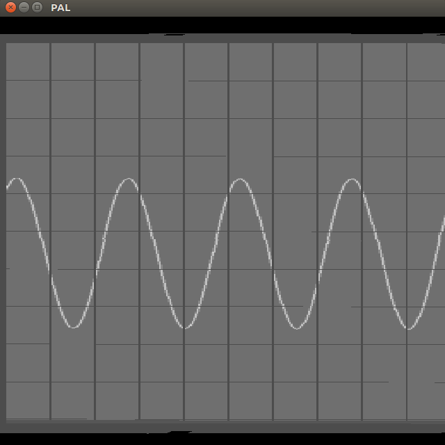

# Composite-video-oscilloscope
n-channel oscilloscope with composite video output for display. 

The purpose of this project is merely to serve a development demonstration and to make use of the nice development tools on a PC.

For the same purpose a simple composite video monitor simulation has also  been developed. See https://github.com/martinsteennielsen/composite-video-monitor

When all the major features are completed, the source code will serve as a template for something suitable for an ESP32 micro controller.

# Usage
To run the program use

`dotnet run -c release`

The composite signal will be sent to published to a ZeroMQ socket listening on `tcp://*:10001`

# Sample

